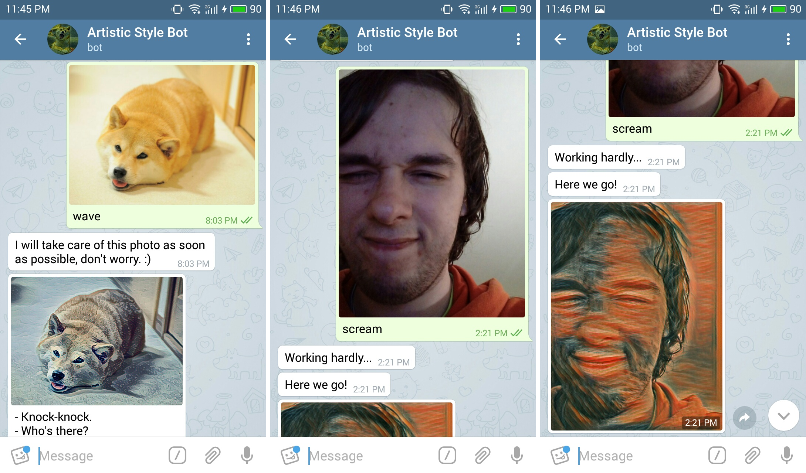

# Artistic Style Bot

Artistic Style Bot turns any of your photos into an "artwork".

<p align="center">
    
</p>

## Installation

Install `python-telegram-bot` from GitHub repo because it seems like `python-telegram-bot` PyPI package is a little bit out of date.

```
$ pip install -r requirements.txt
$ git clone https://github.com/python-telegram-bot/python-telegram-bot
$ cd python-telegram-bot
$ python setup.py install
```

## Run the bot

```
$ python artistic_bot.py --token=<your authentication token>
```


## Training transform net

Download **[@machrisaa](https://github.com/machrisaa/tensorflow-vgg)**'s VGG19 weights [link](https://mega.nz/#!xZ8glS6J!MAnE91ND_WyfZ_8mvkuSa2YcA7q-1ehfSm-Q1fxOvvs).

Download MS-COCO dataset [link](http://msvocds.blob.core.windows.net/coco2014/train2014.zip) and unzip it

```
$ wget http://msvocds.blob.core.windows.net/coco2014/train2014.zip
$ unzip train2014.zip
```

Preprocess MS-COCO

```
$ python process_dataset.py \
    --dataset-dir train2014 \
    --output-dir contents \
    --bucket-size 5000
```

Train a neural network with a new style

```
$ python train_transform_net.py \
    --contents=<path to directory where preprocessed ms-coco is stored> \
    --weights=<path to VGG19 weights> \
    --style=<path to an artwork image> \
    --style-name=<short name of the style> \
    --device=<compute device, for example "/gpu:0">
```

In order to get list of all available options, try running

```
$ python train_transform_net.py --help
```

## References

- [A Neural Algorithm of Artistic Style, Gatys, et al., 2015](https://arxiv.org/abs/1508.06576)
- [Perceptual Losses for Real-Time Style Transfer and Super-Resolution, Johnson, et al., 2016](https://arxiv.org/abs/1603.08155)
- [Instance Normalization: The Missing Ingredient for Fast Stylization, Ulyanov, et al., 2016](https://arxiv.org/abs/1607.08022)
- [Deconvolution and Checkerboard Artifacts, Odena, et al., 2016](http://distill.pub/2016/deconv-checkerboard/)
